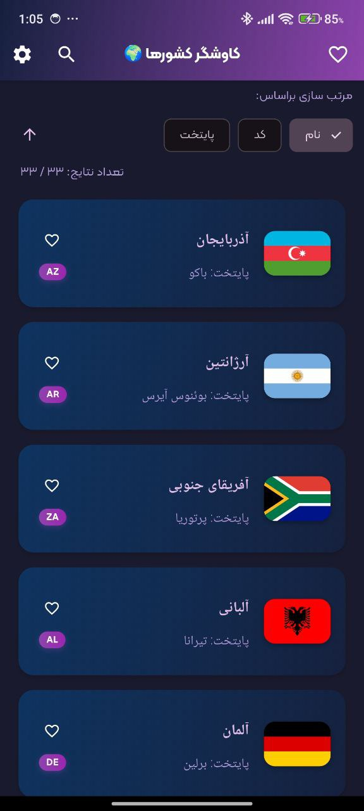
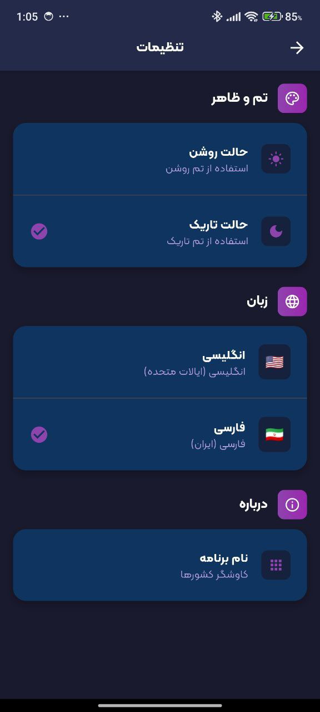

<div align="center">

# 🌍 Countries Explorer App

Discover, search, and filter countries with a modern Flutter app built on Clean Architecture, robust state management, and beautiful Material 3 design.

[](https://flutter.dev)
[](https://dart.dev)
[](#-architecture)
[](https://pub.dev/packages/flutter_bloc)
[](LICENSE)

</div>


## ✨ Overview

The Countries Explorer App showcases a production-grade Flutter setup featuring Clean Architecture (Domain/Data/Presentation), localization (English/Persian, RTL/LTR), dependency injection, solid error handling, offline caching, and polished UI/UX with Material 3.

## ✅ Features

### Core
- Clean Architecture (Domain, Data, Presentation)
- BLoC/Cubit for state management (flutter_bloc)
- Dio HTTP client and a hardened ApiClient wrapper
- Countries list: name, capital, code, and flag image
- Data source: GitHub raw JSON endpoint (configurable)

### Advanced UX
- Dark/Light themes with gradients and thoughtful contrast
- Bilingual (English/Persian) with RTL/LTR support
- Animated splash screen with gradients and progress cue
- Pull-to-refresh on the list
- Shimmer skeleton loading placeholders
- Error view with retry
- Exit confirmation dialog on root back-press

### Engineering Quality
- Dependency Injection via GetIt
- Robust error model (Result/AppError)
- SharedPreferences cache (TTL, configurable)
- .env configuration via flutter_dotenv
- SOLID, DRY, KISS, YAGNI applied pragmatically

### Testing
- Unit tests for data sources and use cases
- Widget tests for UI components
- BLoC/Cubit tests for states and transitions
- Integration test scaffolding

## 🧱 Architecture

```
lib/
├── src/
│   ├── core/
│   │   ├── constants/        # Routes, strings, sizes
│   │   ├── di/               # Dependency Injection (GetIt)
│   │   ├── error/            # Result/AppError types
│   │   ├── localization/     # gen_l10n setup
│   │   ├── network/          # ApiClient (Dio config, retry, logging)
│   │   ├── theme/            # Material 3 themes, colors
│   │   └── widgets/          # Shared widgets (e.g., exit dialog)
│   ├── data/
│   │   ├── datasources/      # Remote/Local sources
│   │   ├── models/           # DTOs / JSON adapters
│   │   └── repositories/     # Repository implementations
│   ├── domain/
│   │   ├── entities/         # Pure domain entities/value objects
│   │   ├── repositories/     # Repository contracts
│   │   └── usecases/         # Application services
│   └── presentation/
│       ├── country_list/     # Feature UI + Cubit
│       ├── settings/         # Theme/Language settings
│       └── splash/           # Splash screen
└── test/                     # Unit/Widget/BLoC tests
```

## 🧩 Tech Stack
- Flutter (Material 3)
- flutter_bloc (Cubit)
- Dio + hardened ApiClient (timeouts, retry w/ backoff & jitter, logging in debug)
- GoRouter (navigation)
- GetIt (DI)
- SharedPreferences (local cache)
- CachedNetworkImage (flag caching)
- Shimmer (skeleton loading)
- flutter_screenutil (responsive sizing)
- flutter_dotenv (environment config)
- gen_l10n (localization, ARB files)

## ⚙️ Setup

### Prerequisites
- Flutter SDK (latest stable)
- Dart SDK (bundled with Flutter)

### Install
1) Fetch dependencies
	 - Open the project in VS Code/Android Studio and run: flutter pub get
2) Create a .env file at the project root (optional)
	 - Example:
		 - COUNTRIES_URL=https://raw.githubusercontent.com/PouriaMoradi021/countries-api/refs/heads/main/countries.json
		 - API_BASE_URL= (leave empty to use absolute URLs per-call)

### Run
- Android/iOS: flutter run
- Web/Desktop: Flutter config dependent; ensure your platform is enabled

### Build
- Android: flutter build apk
- iOS: flutter build ipa (on macOS)
- Web: flutter build web

## 🌐 Localization
- ARB files live under `lib/l10n/` (e.g., `app_en.arb`, `app_fa.arb`).
- Add new keys to both files and rebuild: Flutter’s gen_l10n generates accessors.
- App switches between English and Persian with proper RTL/LTR.

## 🎨 Theming
- Material 3 themes defined in `src/core/theme` with light/dark palettes.
- Dynamic gradients for app bars and cards; careful color contrast in dark mode.
- Settings page lets users toggle theme and language.

## 📡 Networking & Data
- Centralized `ApiClient` wraps Dio with:
	- BaseOptions from `.env` (API_BASE_URL or COUNTRIES_URL)
	- Timeouts, JSON headers, responseType
	- Retry interceptor (idempotent GET/HEAD) with exponential backoff + jitter
	- Debug `LogInterceptor`
- Remote source fetches from the configured COUNTRIES_URL.
- Local cache uses `SharedPreferences` with a configurable TTL via `CountriesCacheConfig`.

## 🧪 Testing
- Unit tests: data sources, use cases, error mapping
- Widget tests: list items, empty/error states, shimmer
- BLoC/Cubit tests: state transitions
- Run tests: flutter test

## 📸 Screenshots

<p align="center">
	
	
	
  
	
</p>

## 🧭 Roadmap
- Optional: ETag/If-Modified-Since support
- Favorites persistence
- More filters (regions, population)

## 🤝 Contributing
Pull requests are welcome. Please:
- Keep changes focused and well-tested
- Follow the existing folder structure and code style
- Use meaningful, semantic commit messages

### Git Flow & Commit Convention

- Branching model:
	- main: production-ready
	- develop: integration branch
	- feature/*: feature branches (merge to develop via no-ff)
	- hotfix/*: urgent fixes from main
- Conventional commits + emojis (examples):
	- feat: ✨ new feature
	- fix: 🐛 bug fix
	- chore: 🛠️ tooling/config
	- docs: 📝 docs
	- style: 🎨 formatting
	- refactor: ♻️ refactor
	- perf: 🚀 performance
	- test: ✅ tests
	- build: 📦 build system
	- ci: 🔁 CI/CD
	- merge: 🔀 merge
	- revert: ⏪ revert
	- fire/remove: 🔥 removals

Example:
	feat(countries): ✨ add search debounce and favorites toggle

## 📄 License
This project is licensed under the terms described in [LICENSE](LICENSE).

---

